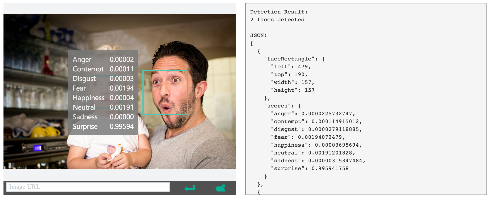

# Danger Drone

Entry for the Feb 2017 Dublin AI Hackathon.

It's a web app targeted for the [Hololens](https://www.microsoft.com/microsoft-hololens/en-us) edge browser that allows the wearer to control the motion of a camera attached to a Raspberry Pi. There's a frontend bit that lives in the browser which talks to a flask app running on the Pi which then talks to Microsoft's [Cognitive Services Emotion API](https://www.microsoft.com/cognitive-services/en-us/emotion-api).

The microsoft api is some pre-trained magic that you send a binary blob to and it gives you back some json:

You navigate to the web app and you're presented with a range slider to control pan movement as well as two buttons, one that detects the emotions of the people in frame and another that randomly pans the camera until it detects a person with the desired emotion.

The idea is that this type of control system could be deployed on some sort of drone (ideally with more than one axis of motion) which can be flying around searching for happy people or some more interesting application of AI, perhaps a drone that can find angry people to shoot at.

## Dependencies

The project is dependent on this thing being set up and running:
https://github.com/silvanmelchior/RPi_Cam_Web_Interface

## Running
Bleugh.

## Future Dev
No. If you wanted, the first place for easy expansion is to change the "Find Emotion" button to a find emotion dropdown where you select the emotion as opposed to it defaulting to happiness. I'd also serve the web app on a flask route instead of spinning up a separate static python http server for it.
